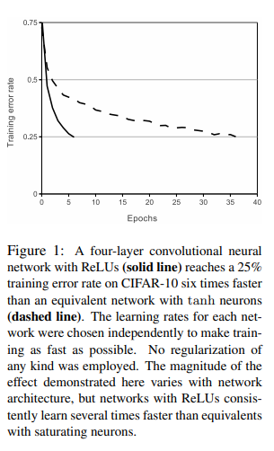
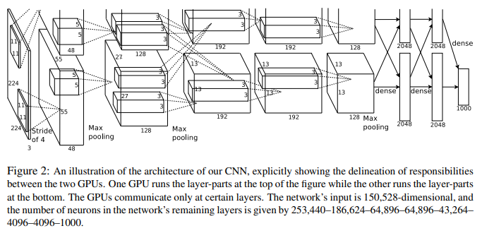

# 🔥 AlexNet-PyTorch-Implementation

- This repository contains a replication of the **ImageNet Classification with Deep Convolutional Neural Networks** paper by Alex Krizhevsky, Ilya Sutskever, and Geoffrey Hinton. The goal is to implement the **AlexNet** architecture as described in the original paper, preserving convolutional, pooling, normalization, and fully connected layers. This implementation focuses on image classification on the ImageNet dataset.

**Paper**: [ImageNet Classification with Deep Convolutional Neural Networks (NIPS 2012)](https://papers.nips.cc/paper/4824-imagenet-classification-with-deep-convolutional-neural-networks.pdf)

---

## 🏗 Model Overview

- **AlexNet** was a breakthrough in deep learning, showing the power of deep convolutional networks on large-scale image classification.  
- The network consists of **5 convolutional layers**, some followed by **max-pooling**, **local response normalization (LRN)**, and **3 fully connected layers**.  
- ReLU activations are used after each convolution and fully connected layer.  
- The network was trained on the ImageNet dataset with over 1 million images across 1000 classes.  

---

## 🗂 Project Structure

```bash
AlexNet-PyTorch-Implementation/
│
├── src/
│   ├── conv_layers.py          # Conv1-Conv5 definitions
│   ├── relu_layers.py          # ReLU activations
│   ├── pool_layers.py          # MaxPooling layers
│   ├── normalization_layers.py # Local Response Normalization (LRN)
│   ├── fc_layers.py            # Fully Connected Layers (FC6, FC7, FC8)
│   └── alexnet_model.py        # Complete AlexNet model combining all layers
│
├── images/
│   ├── architecture.png        # AlexNet architecture overview
│   ├── conv_layers.png
│   ├── pooling_layers.png
│   └── fc_layers.png
│
├── datasets/
│   └── imagenet_dataset.py     # ImageNet dataset loader with augmentations
│
├── README.md
└── requirements.txt
```

---

## 📊 Figures

### Figure 1 – AlexNet Architecture


- Illustrates the complete AlexNet architecture: 5 convolutional layers, 3 max-pooling layers, 2 LRN layers, and 3 fully connected layers.  
- Input: 224×224×3 image, Output: 1000-class softmax probabilities.

### Figure 2 – Convolutional Layers


- Shows Conv1–Conv5 with kernel sizes, strides, padding, and output feature map dimensions.

### Figure 4 – Fully Connected Layers


- Demonstrates FC6–FC8 layers: flattening the output of the last conv layer and producing 4096→4096→1000 features.

---

## 🔗 Feedback

For questions or feedback, contact: [barkin.adiguzel@gmail.com](mailto:barkin.adiguzel@gmail.com)
