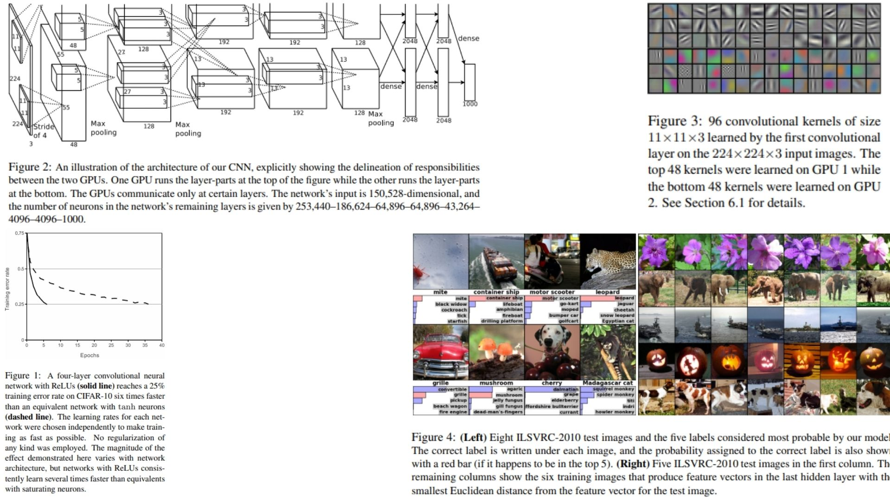

# 🔥 AlexNet-PyTorch-Implementation

- This repository contains a replication of the **ImageNet Classification with Deep Convolutional Neural Networks** paper by Alex Krizhevsky, Ilya Sutskever, and Geoffrey Hinton. The goal is to implement the **AlexNet** architecture as described in the original paper, preserving convolutional, pooling, normalization, and fully connected layers. This implementation focuses on image classification on the ImageNet dataset.

**Paper**: [ImageNet Classification with Deep Convolutional Neural Networks (NIPS 2012)](https://papers.nips.cc/paper/4824-imagenet-classification-with-deep-convolutional-neural-networks.pdf)

---

## 🖼 Overview – AlexNet Architecture

This figure presents a **unified overview of AlexNet**, combining all key components of the network: convolutional layers, max-pooling layers, local response normalization (LRN), and fully connected layers.  

- **AlexNet** was a breakthrough in deep learning, showing the power of deep convolutional networks on large-scale image classification.  
- The network consists of **5 convolutional layers**, some followed by **max-pooling**, **local response normalization (LRN)**, and **3 fully connected layers**.  
- ReLU activations are used after each convolution and fully connected layer.  
- The network was trained on the ImageNet dataset with over 1 million images across 1000 classes.

> 💡 Original AlexNet split some layers across two GPUs for faster training on large data. Our implementation runs on a single GPU, keeping outputs and performance consistent with the paper.

---
## 🔑 Key Formulas

1. **Convolutional Layer:**  

$$y_{i,j,k}^{(l)} = f\Bigg(\sum_{c=1}^{C_{l-1}} \big(x^{(l-1)}_c * W^{(l)}_{k,c}\big)_{i,j} + b^{(l)}_k\Bigg)$$

- $x^{(l-1)}_c$ = input feature map of previous layer  
- $W^{(l)}_{k,c}$ = convolution kernel  
- $b^{(l)}_k$ = bias  
- $f$ = ReLU activation

2. **Local Response Normalization (LRN):**  

$$b^l_{x,y} = \frac{a^l_{x,y}}{\Big(k + \alpha \sum_{i=\max(0,l-n/2)}^{\min(N-1,l+n/2)} (a^i_{x,y})^2 \Big)^\beta}$$

- Normalizes activations across channels  
- Hyperparameters: $k$, $n$, $\alpha$, $\beta$ (e.g., $k=2, n=5, \alpha=10^{-4}, \beta=0.75$)

3. **Fully Connected Layer:**  

$$y = f(Wx + b)$$
 
- Flattens convolutional output  
- Maps to output classes with softmax at final layer

> These formulas summarize AlexNet’s **core computations**: convolutional feature extraction, ReLU non-linearity, normalization (LRN), and end-to-end classification.

---

```bash
AlexNet-PyTorch-Implementation/
│
├── src/
│   ├── conv_layers.py          # Conv1-Conv5 definitions
│   ├── relu_layers.py          # ReLU activations
│   ├── pool_layers.py          # MaxPooling layers
│   ├── normalization_layers.py # Local Response Normalization (LRN)
│   ├── fc_layers.py            # Fully Connected Layers (FC6, FC7, FC8)
│   └── alexnet_model.py        # Complete AlexNet model combining all layers
│
├── images/
│   ├── figure1.png        # AlexNet architecture overview
│   ├── figure2.png  
│   ├── figure4.png  
│   └── norm.png
│
├── datasets/
│   └── imagenet_dataset.py     # ImageNet dataset loader with augmentations
│
├── README.md
└── requirements.txt
```

---

## 🔗 Feedback

For questions or feedback, contact: [barkin.adiguzel@gmail.com](mailto:barkin.adiguzel@gmail.com)
